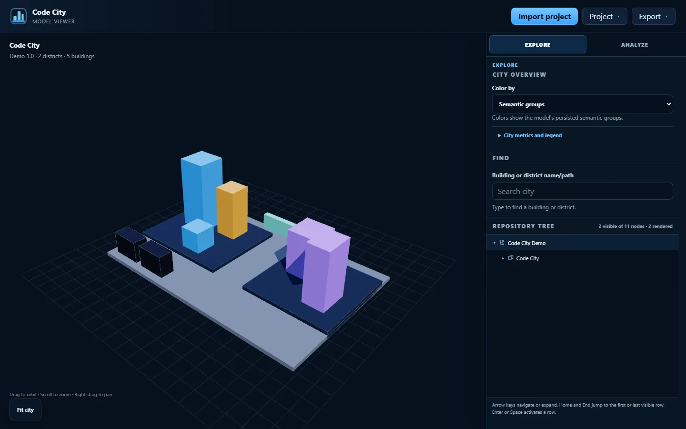
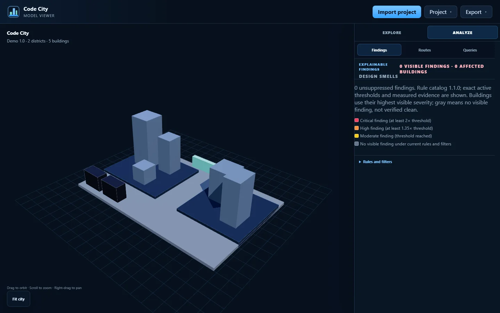

# Code City


**Turn a software repository into an interactive 3D city, explore how it
changes, and export it as an image or physical model.**

<p>
  
  
</p>

## What it can do

- Import a **Git repository**, **source folder or ZIP**, or generated Code City
  model. GitHub, Azure DevOps, HTTPS, SSH, and scp-style Git are supported.
- Explore solutions, modules, districts, buildings, dependencies, source
  hierarchy, metrics, findings, saved queries, and representative history.
- Export documentation images, STL, deterministic 3MF, multi-plate layouts,
  physical labels, dependency routes, and Prusa XL five-tool models.
- Publish sanitized immutable city snapshots with latest and permanent public
  links, version history, republishing, and revocation.
- Keep analysis self-hosted. Repository code is inspected, never built or
  executed, and credentials stay in administrator-controlled server profiles.
- Run on AMD64 or ARM64 from one non-root container with one persistent volume.

## Start Code City

After the 1.0.0 image is published, one command starts the complete viewer and
API with persistent storage:

```bash
docker run --detach --name code-city --restart unless-stopped --publish 8080:3000 --volume code-city-data:/data ghcr.io/felixgeisler/code-city:1.0.0
```

Open **http://localhost:8080**.

Authorization is disabled by default for convenient trusted-network use. Do
not expose that mode directly to the public Internet. Configure authorization,
allowed hosts, a public origin, and exact credential profiles before an
Internet-facing deployment. Published snapshots are intentionally readable by
anyone who can reach the server.

To build the container from this source checkout instead:

```bash
docker compose up --build
```

## Development

Requirements: **Node.js 24.x**, **npm 11.6.2**, **.NET SDK 10.0.302**, and Git.

```bash
npm ci
npm run verify
npm run viewer:dev
```

`npm run viewer:dev` starts both the real viewer and API with same-origin
`/api` calls at **http://127.0.0.1:5173/**. Development data is private and
local; see the deployment documentation before using production credentials.

## Documentation and release information

- [Architecture and operating documentation](docs/modules/ROOT/pages/index.adoc)
- [Release, backup, restore, upgrade, and rollback procedure](docs/modules/ROOT/pages/14-release-and-operations.adoc)
- [1.0.0 release notes](RELEASE_NOTES.md) and [changelog](CHANGELOG.md)
- [Security policy](SECURITY.md) and [third-party notices](THIRD_PARTY_NOTICES.md)

Code City is an independent implementation of the established “code city”
software-visualization concept. It is licensed under the
[Apache License 2.0](LICENSE); the license does not grant trademark rights. See
[NOTICE](NOTICE) for the project-name boundary.
